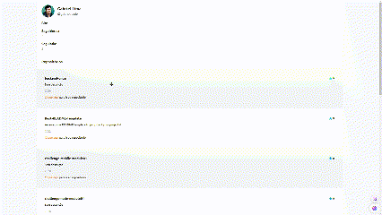

# About the project

This project is a client-side, which queries the GitHub API and shows the most popular repositories for a given user.

This project was built using the following technologies
- React js
- Vite
- Tailwind css

## How to run

```
npm install i
```
```
npm run dev
```

 To view/search a github profile, simply add the username to the URL.

 ```
 http://localhost:5173/user/:username
 ```

 To move the order just drag as in the example below.

 ## Preview



## Website hosting

This project is hosted on vercel, follow the link below.

note: change 'username ' to a real username
```
https://desbravador-challenge-git-master-gabrielnode.vercel.app/user/:username
```